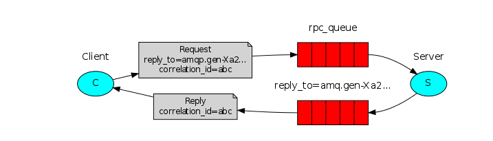

spring-amqp rpc远程调用示例
===

这是我整理的spring-amqp rpc远程调用的完整示例, 使用spring-boot的方式进行, 目前在网上还没有找到相应的示例. 同时根据rabbitmq rpc调用原理做了多种配制,

关于rabbitmq rpc的原理请参考:

[Remote procedure call (RPC)](https://www.rabbitmq.com/tutorials/tutorial-six-java.html)
[Remote procedure call (RPC) 中文](http://ifeve.com/rabbitmq-rpc/)
[Remote procedure call (RPC) 中文2](https://www.cnblogs.com/xingyunblog/p/10008042.html)
[RabbitMQ 实现RPC](https://www.cnblogs.com/LiangSW/p/6216537.html)
[rabbitmq 学习系列](https://www.cnblogs.com/xingyunblog/category/1237584.html)

要理解这个图 

